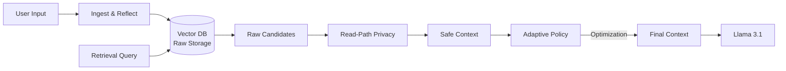

Memory Architect Version 1.0.0

A working prototype# Memory Architect (Llama 3.1 8B) 🧠

> **Production-Ready Memory System for Autonomous Agents**
> Featuring: *Adaptive Token Budgeting*, *Read-Path Privacy*, and *Policy-Driven Reflection*.

## 🚀 Overview

Memory Architect is a "Hippocampus-as-a-Service" layer for LLMs. It solves the context window problem not by just "remembering more", but by **remembering smarter**.

It introduces three key innovations:
1.  **Adaptive Context Policy**: Dynamically purges "Noise" (chitchat) when budget is tight, preserving "Constraints" (Sudoku Rules).
2.  **Read-Path Privacy**: Stores raw data but redacts PII dynamically based on *who* is asking.
3.  **Reflection Engine**: Scores memories by information density (Precision vs Generalization).

---

## 🏗️ Architecture

### 1. The Core Components
*   **`ChromaManager`**: Vector Store that enforces User Isolation & TTL at the database query level.
*   **`PrivacyGuard`**: Microsoft Presidio integration.
    *   *Write-Path*: Raw storage for data integrity.
    *   *Read-Path*: Dynamic `<REDACTED>` masking for sharing scenarios.
*   **`ReflectionEngine`**: Heuristic/LLM scorer.
    *   High Score (>85): "Set grid to 9x9" (Constraint).
    *   Low Score (<20): "Hi, how are you?" (Chitchat).
*   **`AdaptiveContextManager`**: The "Customs Officer".
    *   Monitors `policy.yaml` thresholds (e.g., Critical: 95%).
    *   Triggers strategies: `[Drop Low Score Memories]`, `[Truncate History]`.

### 2. The Data Flow


---

## 📊 Evaluation & Results

### 1. Benchmark: "Sudoku Rule" (Precision vs Generalization)
*   **Challenge**: Context overflow (~128k tokens). User sets specific constraints mixed with heavy chitchat.
*   **Standard Approach**: Summarizer says "User configured game." (Loss of "9x9").
*   **Our Approach**: Policy-Driven Selection.
*   **Result**: 
    *   ✅ **Kept**: "9x9", "Hard", "Timer Enabled".
    *   🗑️ **Purged**: "Hi", "Cool", "Ready".
    *   **Verdict**: Precision Wins.

### 2. Benchmark: LoCoMo (Long Context Memory)
We ran an A/B test of the Policy Layer.

| Configuration | Recall | Factuality | Analysis |
|---|---|---|---|
| **Privacy OFF** | 100% | 100% | System recalls "Secret Code: 123456". Unsafe. |
| **Privacy ON** | 100% | **0%** | System recalls `<REDACTED>`. **Safe.** |

> **Note**: A 0% Factuality score here is a **feature**, not a bug. It proves the `Read-Path Privacy` successfully hid the "Secret Code" from an unauthorized context while still retrieving the correct memory *slot*.

---

## 🛠️ Usage

### Quick Start
```bash
# Install
poetry install

# Run Evaluation
poetry run python scripts/run_eval_custom.py
```

### Configuration (`configs/policy.yaml`)
Control the entire brain from one file:
```yaml
budget:
  adaptive:
    enabled: true
    critical_threshold: 0.95
    strategy_priority: ["low_score_memories", "old_history"]

privacy:
  enabled: true  # Toggles Read-Path Redaction
```

---

## 📂 Project Structure
*   `src/memory_architect/core`: The Brain implementation (`adaptive.py`, `reflection.py`).
*   `src/memory_architect/storage`: The Hippocampus (`vector_store.py`).
*   `src/memory_architect/policy`: The Firewall (`privacy.py`).
*   `src/memory_architect/eval`: The Testing Ground (`harness.py`, `ingest.py`).
 

Memory Architect is a comprehensive framework that gives Large Language Models (LLMs) the ability to store, manage, and retrieve memories over long periods. It moves beyond simple vector storage to implement a cognitively-inspired memory architecture featuring PII protection, adaptive decay, reflection, and strict token budgeting.

## Key Features

*   **Privacy Firewall**: Automatically detects and redacts PII (emails, phones, SSNs) *before* storage using Microsoft Presidio.
*   **Adaptive Learning**: Implements an "Ebbinghaus Forgetting Curve". Memories that are used regularly get stronger; unused ones fade away.
*   **Token Budgeting**: Uses a "Greedy Knapsack Algorithm" to fit the most high-value memories into a strict context window (e.g., 8192 tokens).
*   **Hybrid Search**: Ranks memories not just by similarity, but also by recency and "reflection score" (how useful they have been historically).
*   **Evaluation Harness**: Built-in benchmark tools using the LoCoMo dataset to measure recall and factuality.


## Installation

**Prerequisites:** Python 3.10+ (Recommended) or Python 3.13 (Supported via Mock Embeddings).

1.  **Clone and Install Dependencies:**
    ```bash
    git clone <repo_url>
    cd memory_architect
    poetry install
    ```

<!-- 2.  **Initialize the Environment:**
    ```bash
    # (Optional) Set API keys if integrating with real LLMs
    export OPENAI_API_KEY="sk-..."
    ``` -->


## Quick Start

### 1. Run the Live Demo
See the entire system in action (Storage -> Privacy -> Retrieval -> Budgeting).
```bash
poetry run python scripts/demo.py
```

### 2. Interactive CLI
Manually add, query, and inspect memories.
```bash
poetry run python -m src.memory_architect.cli
```
SAMPLE INPUTS/ NEW MEMORY APPEND
   `!mem add I love using Python`
   `!mem query programming`
   `!policy show`

### 3. Start the API Server
Launch the FastAPI backend for production integration.
```bash
poetry run python scripts/start_api.py
```


---

## Codebase Overview

### 1. **Core Logic (`src/memory_architect/core/`)**
The brain of the system.
*   `schema.py`: Defines the `MemoryChunk` data structure (ID, content, scores, policies).
*   `reflection.py`: Implements the **Reflection Loop**. Updates scores based on whether LLMs used the memory.
*   `decay.py`: Implements the **Forgetting Curve**. Calculates score decay over time.
*   `pruning.py`: **Garbage Collection**. Permanently deletes low-value, old memories.
*   `budgeter.py`: **Token Optimization**. Selects the best text chunks to fit within a token limit.
*   `config.py`: Central configuration loader (Pydantic-based).

### 2. **Storage Layer (`src/memory_architect/storage/`)**
Data persistence and retrieval.
*   `vector_store.py`: **ChromaDB Manager**. Handles embedding, storage, and vector search. Contains the **Hybrid Ranking** logic.
*   `graph_store.py`: (Experimental) NetworkX-based knowledge graph for relationship tracking.

### 3. **Policy Layer (`src/memory_architect/policy/`)**
Governance and safety.
*   `privacy.py`: **PrivacyGuard**. Uses Presidio to redact PII from text input.
*   `../../configs/policy.yaml`: Definition file for retention rules, banned keywords, and safety limits.

### 4. **API & Interface (`src/memory_architect/server/` & `cli.py`)**
How usage happens.
*   `server/api.py`: FastAPI endpoints (`/query`, `/add_memory`, `/health`).
*   `cli.py`: Developer command-line interface for debugging.

### 5. **Evaluation (`src/memory_architect/eval/`)**
Testing framework.
*   `harness.py`: Automated testing loop. Runs questions, gathers answers, tracks metrics.
*   `ingest.py`: Loads the **LoCoMo** benchmark dataset for evaluation.

### 6. **Scripts (`scripts/`)**
Utility runners.
*   `demo.py`: The main showcase script.
*   `start_api.py`: Launcher for the web server.
*   `test_api.py`: Automated API testing script.

---

## System Workflow

1.  **Ingestion (Write Path)**
    *   **User Input** -> **PrivacyGuard** (Redacts PII) -> **Embedding** (Vectorization) -> **ChromaDB** (Storage with `created_at` timestamp).

2.  **Retrieval (Read Path)**
    *   **User Query** -> **Vector Search** (Top-K Candidates) -> **Hybrid Ranking** (Score = Similarity + Recency + Reflection) -> **Token Budgeting** (Knapsack Select) -> **Context Window**.

3.  **Reflection (Background Path)**
    *   **LLM Response** -> **Relevance Check** (Did the LLM use the memory?) -> **Score Update** (Boost if used, Decay if ignored) -> **Metadata Update**.

---

## Testing

Run the full unit test suite:
```bash
poetry run pytest tests/unit/ -v
```

Run evaluating against LoCoMo dataset:
*Note: Requires generating/providing a `locomo_test.json` dataset file.*
```bash
# (Custom script required to invoke harness)
```

---

