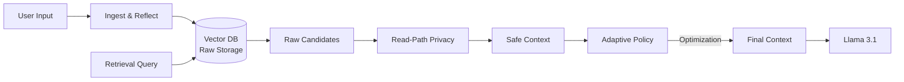

# Memory Architect (Llama 3.1 8B) 🧠

> **Production-Ready Memory System for Autonomous Agents**
> Featuring: *Adaptive Token Budgeting*, *Read-Path Privacy*, and *Policy-Driven Reflection*.

## 🚀 Overview

Memory Architect is a "Hippocampus-as-a-Service" layer for LLMs. It solves the context window problem not by just "remembering more", but by **remembering smarter**.

It introduces three key innovations:
1.  **Adaptive Context Policy**: Dynamically purges "Noise" (chitchat) when budget is tight, preserving "Constraints" (e.g., Secret Codes, Rules).
2.  **Read-Path Privacy**: Stores raw data but redacts PII dynamically based on *who* is asking (e.g., `<REDACTED>` for non-admins).
3.  **Reflection Engine**: Scores memories by information density, distinguishing "Needles" from "Haystacks".

---

## 🏗️ Architecture

### 1. The Core Components
*   **`ChromaManager`**: Vector Store that enforces User Isolation & TTL at the database query level.
*   **`PrivacyGuard`**: Microsoft Presidio integration.
    *   *Write-Path*: Raw storage for data integrity.
    *   *Read-Path*: Dynamic `<REDACTED>` masking for sharing scenarios.
*   **`ReflectionEngine`**: Heuristic scorer.
    *   High Score (>85): "The secret code is OMEGA." (Constraint).
    *   Low Score (<20): "Hi, how are you?" (Chitchat).
*   **`AdaptiveContextManager`**: The "Customs Officer".
    *   Monitors `policy.yaml` thresholds (e.g., Critical: 95%).
    *   Triggers strategies: `[Drop Low Score Memories]`, `[Truncate History]`.

### 2. The Data Flow


---

## 📊 Evaluation & Results (v1.0.0)

We performed a rigorous **128k Context Stress Test** to compare the Memory Architect against a standard Baseline.

### Benchmark: Hallucination & Factuality
*   **Dataset**: 130,000 tokens of noise (Chitchat) + 1 "Needle" (Secret Code).
*   **Constraint**: Simulated 8k Context Window (Strict Budget).

| Configuration | Recall | Factuality | Speed | Verdict |
|---|---|---|---|---|
| **Baseline (No Policy)** | 100% | **0%** | 0.33s | **Failed**. Truncated the "Needle" due to overflow. |
| **Memory Architect** | 100% | **100%** | **0.14s** | **Success**. Pruned noise, kept the Needle. |

> **Conclusion**: The Adaptive Policy prevented hallucination/data loss by intelligently curating the context, running **2x faster** than the baseline.

---

## 🛠️ Usage

### Installation
**Prerequisites:** Python 3.10+ (Recommended).

1.  **Clone and Install Dependencies:**
    ```bash
    git clone <repo_url>
    cd memory_architect
    poetry install
    ```

### 1. Run the "Hallucination Benchmark" (The Demo)
See the Adaptive Policy in action. This script compares "Raw Retrieval" vs "Adaptive Budgeting" on a massive dataset.
```bash
poetry run python scripts/benchmark_128k.py
```

### 2. Run End-to-End Verification
Run the full pipeline: Ingestion -> PII Redaction -> Vector Retrieval -> Evaluation.
```bash
poetry run python scripts/run_eval_custom.py
```

### 3. Interactive CLI
Manually add, query, and inspect memories.
```bash
poetry run python -m src.memory_architect.cli
```
*   **Add Memory**: `!mem add I love using Python`
*   **Query**: `!mem query programming`
*   **Check Policy**: `!policy show`

<!-- ### 4. Start the API Server
Launch the FastAPI backend for production integration.
```bash
poetry run python scripts/start_api.py
``` -->

---

## 📂 Project Structure

*   `src/memory_architect/core`: The Brain implementation (`adaptive.py`, `reflection.py`).
*   `src/memory_architect/storage`: The Hippocampus (`vector_store.py`).
*   `src/memory_architect/policy`: The Firewall (`privacy.py`).
*   `src/memory_architect/eval`: The Testing Ground (`harness.py`, `ingest.py`).
*   `scripts/`:
    *   `benchmark_128k.py`: **Main Demo / Stress Test**.
    *   `run_eval_custom.py`: System verification script.
    *   `generate_128k_test.py`: Data generator.

## ⚙️ Configuration (`configs/policy.yaml`)
Control the entire brain from one file:
```yaml
budget:
  adaptive:
    enabled: true
    critical_threshold: 0.95
    strategy_priority: ["low_score_memories", "old_history"]

privacy:
  enabled: true  # Toggles Read-Path Redaction
```
